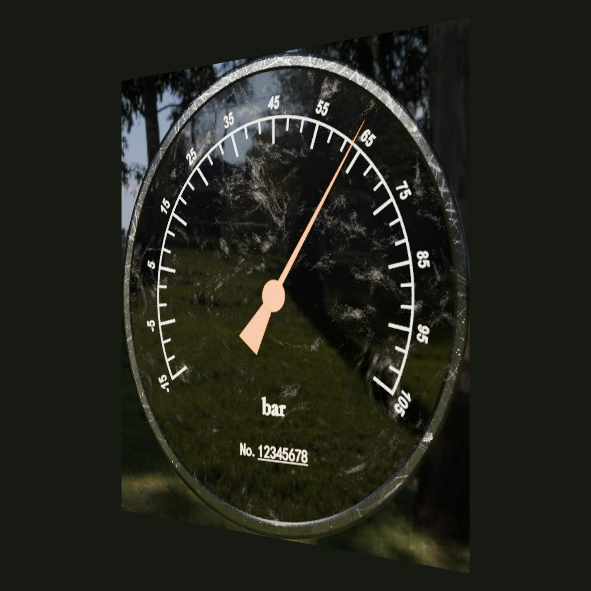
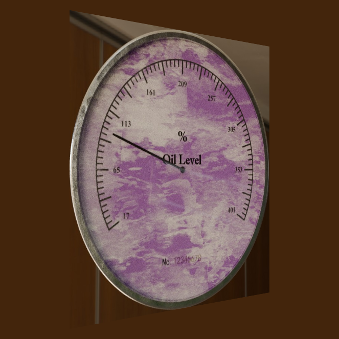
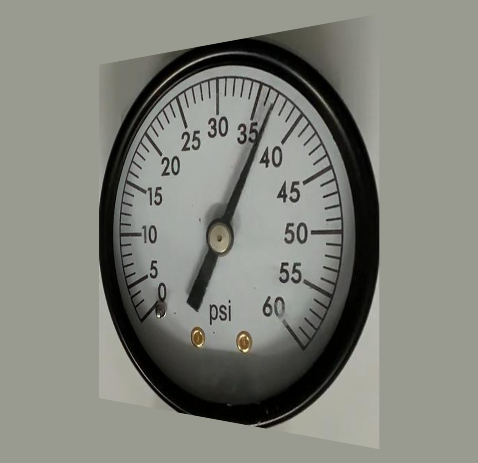
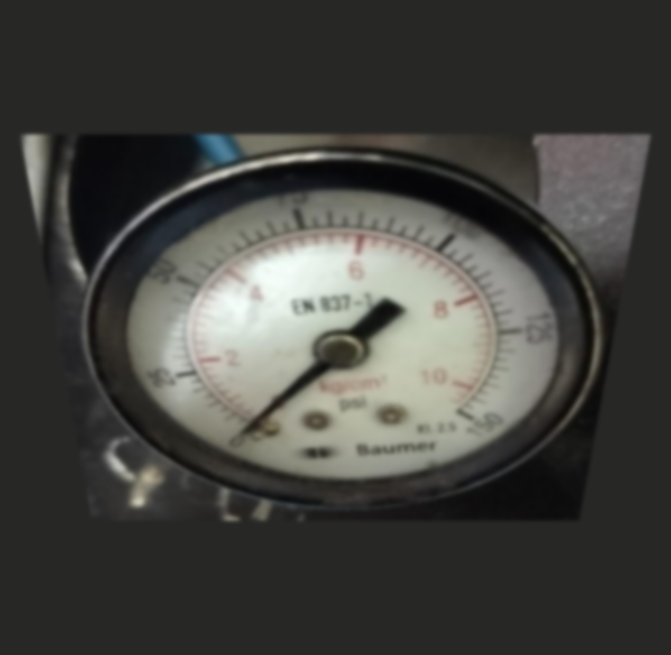
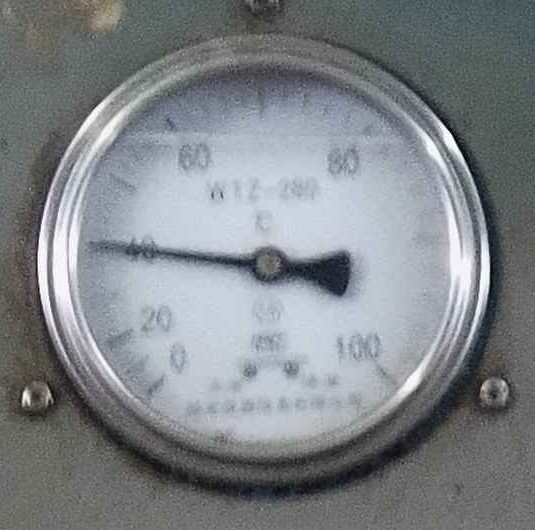
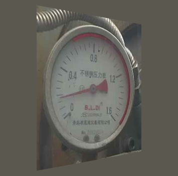

# 六例跨数据集读数对照候选

这是六例跨数据集读数对照的图片与逐样本记录。保留四个优先候选，并加入两个不同采集组、不同留出折的工业样本。未重新训练或推理，未制作论文排版图。

数值统一为 **[0,1] 归一化满量程进度**，不是表盘印刷单位。误差乘 100 即 %FS；例如 0.004278 = 0.4278%FS。所有表格保留表现好的对照。

## 展示读数

SyncG、RF100 的四种方法统一展示 seed **20262020**。Industrial 的 GeoPRR 显示论文对应的三编码器 **OOF 等权聚合**，其他方法显示 seed 20262020。三种子以及每个 OOF 编码器的完整精度值保存在 CSV 和 JSON。两例 Industrial 的 VDN / DeepLab 已同步至 `roi_source_pose_reference_20260907` 新版逐图结果，与新版汇总使用同一来源。

| 案例 / 图片 | sample_id | 条件 | GT | GeoPRR-Net | VDN | YOLO11s-Pose-4KP | DeepLabV3+-ROI |
|---|---|---|---:|---:|---:|---:|---:|
| [syncg_01](images/syncg_01.png) | sync_10048 | perspective_severe | 0.650861 | 0.646584 | 0.593444 | 0.573274 | 0.605826 |
| [syncg_02](images/syncg_02.png) | sync_3924 | perspective_severe | 0.208067 | 0.203240 | 0.250173 | 0.277260 | 0.256570 |
| [rf100_01](images/rf100_01.png) | rf100_test_000104 | perspective_severe | 0.601138 | 0.583916 | 0.578842 | 0.533713 | 无有效输出 |
| [rf100_02](images/rf100_02.png) | rf100_test_000058 | combined_severe | 0.027078 | 0.026490 | 0.025000 | 0.542900 | 0.723486 |
| [industrial_01](images/industrial_01.png) | real_001150 | clean | 0.400000 | 0.399704 | 0.156284 | 0.179720 | 0.174306 |
| [industrial_02](images/industrial_02.png) | real_000267 | perspective_severe | 0.112500 | 0.112200 | 0.071745 | 0.641992 | 1.000000 |

## 绝对误差与种子稳定性

| 案例 | 展示 GeoPRR 误差 | VDN 误差 | YOLO 误差 | DeepLab 误差 | GeoPRR 三种子/编码器误差范围 | 三种子均 >0.05 的对照 |
|---|---:|---:|---:|---:|---:|---|
| syncg_01 | 0.004278 | 0.057418 | 0.077588 | 0.045035 | 0.002413–0.012529 | VDN, YOLO11s-Pose-4KP |
| syncg_02 | 0.004827 | 0.042106 | 0.069193 | 0.048503 | 0.004827–0.010013 | YOLO11s-Pose-4KP |
| rf100_01 | 0.017222 | 0.022296 | 0.067425 | 1.0（失败计分） | 0.001071–0.017222 | 无同一对照满足；按种子检查 |
| rf100_02 | 0.000588 | 0.002078 | 0.515822 | 0.696409 | 0.000154–0.007319 | YOLO11s-Pose-4KP, DeepLabV3+-ROI |
| industrial_01 | 0.000296 | 0.243716 | 0.220280 | 0.225694 | 0.003234–0.006800 | VDN, YOLO11s-Pose-4KP, DeepLabV3+-ROI |
| industrial_02 | 0.000300 | 0.040755 | 0.529492 | 0.887500 | 0.005127–0.012911 | YOLO11s-Pose-4KP, DeepLabV3+-ROI |

六例的 GeoPRR 三种子/编码器单独误差均 ≤0.02。RF100-01 的 seed20 DeepLab 为真实 `fail / pointer_component_too_short`，其 `prediction` 留空，正式误差计分为 1.0；seed21 DeepLab 是有效的 **0.0** 预测，不能混作缺失或失败。该例 GeoPRR 每个种子都优于同种子的各对照，但没有同一个对照连续三个种子误差都 >0.05。
RF100-02 的 VDN seed20 误差仅 0.002078；新版 Industrial-02 的 VDN seed20 误差为 0.040755，另两种子误差为 0.788390 / 0.737300。Industrial-02 的 DeepLab 三种子误差为 0.887500 / 0.767050 / 0.724299；seed20 的 1.0 是有效预测，误差为 0.8875，不能混作失败计分。所有结果均如实保留，不能把六例描述成所有对照均失败。

## 图片逐例检查

### syncg_01 — sync_10048

合成黑色压力盘，盘面有强烈背景反射纹理，细橙针朝右上；正式 yaw +45° 透视使表盘明显变窄。没有额外高斯模糊，不能称为真实现场照片。

来源组：`je_gray_02_4k`。



[可选指针区域放大查看](images/syncg_01_pointer_zoom.png)。完整正式输入为 591×591 像素；放大图仅为独立裁剪，不是模型输入。

### syncg_02 — sync_3924

合成紫白斑驳纹理油位盘，黑色细针朝左上、处于较低量程；正式 yaw -45° 透视压缩刻度间距。纹理与细刻度增加视觉干扰，没有额外高斯模糊。

来源组：`empty_play_room_4k`。



[可选指针区域放大查看](images/syncg_02_pointer_zoom.png)。完整正式输入为 663×663 像素；放大图仅为独立裁剪，不是模型输入。

### rf100_01 — rf100_test_000104

黑框白底单刻度压力盘，细针朝右上，粗配重朝左下，下半盘照明较暗。原图较清晰且近正面；明显椭圆压缩来自正式 yaw +45° 变换，没有额外模糊。

来源组：`rf100_meter_b`。



[可选指针区域放大查看](images/rf100_01_pointer_zoom.png)。完整正式输入为 478×463 像素；放大图仅为独立裁剪，不是模型输入。

### rf100_02 — rf100_test_000058

接近零位的双刻度压力盘，粗配重与细指针方向相反。原照片已有软焦、反光与不均匀照明；正式 pitch +45° 及 σ=2.178 px 高斯模糊进一步压缩表盘、弱化密集刻度。VDN 在展示种子也很准确。

来源组：`rf100_whatsapp_2024-01-08`。



[可选指针区域放大查看](images/rf100_02_pointer_zoom.png)。完整正式输入为 744×726 像素；放大图仅为独立裁剪，不是模型输入。

### industrial_01 — real_001150

现场温度盘，细针朝左，盘面低对比、数字与刻度模糊、颗粒明显，金属边缘反光。clean 只表示没有额外合成退化，原始拍摄并不清晰。

来源组：`real_group_010`。采集集合：`photo_collection_01`；GeoPRR OOF fold：`2`（原始 0-based ID）。



[可选指针区域放大查看](images/industrial_01_pointer_zoom.png)。完整正式输入为 535×530 像素；放大图仅为独立裁剪，不是模型输入。

### industrial_02 — real_000267

现场红指针压力盘，低读数、密集刻度，原图已有侧视、不均匀照明与线缆背景；正式 yaw -45° 再次压缩表盘。新版源域参考点下，展示种子的 VDN 误差为 0.040755，DeepLab 读数为 1.0、误差为 0.887500；DeepLab 该输出为有效记录，不是失败计分。

来源组：`real_group_041`。采集集合：`photo_collection_03`；GeoPRR OOF fold：`4`（原始 0-based ID）。



[可选指针区域放大查看](images/industrial_02_pointer_zoom.png)。完整正式输入为 355×351 像素；放大图仅为独立裁剪，不是模型输入。

## 记录对应与文件结构

```text
selected_cases/
  images/                      # 6 张正式条件 ROI + 6 张可选针区裁剪
  case_predictions.csv         # 74 行，四方法全部种子及工业 OOF 分量
  case_metadata.json           # 每例来源、处理参数、模型身份、原始选中行、真实遥测
  README.md
```

CSV 的关联键为 `(case_id, method, seed, fold_id, prediction_type)`。每行的 `metadata_pointer` 指向 JSON 内对应记录；`source_file` 为逻辑相对来源路径，`source_locator` 为 JSON pointer 或 JSONL 行号。外部源文件并未打包，绝对本机路径与工业原始身份映射仅留在本地审计材料。
`target` 在每行重复，直接与相同 `case_id` 的正式图片对应。`prediction_type=oof_encoder_row_weighted` 为工业单编码器 OOF；`oof_equal_weight_ensemble` 为最终三编码器均值，其 seed 留空。CSV `seed` 是编码器种子；不同的特征头拟合种子另存 `head_fit_seed`。三编码器都属于相同样本的同一留出折。比较器的 `fold_id` 留空。
`status` 与原始记录相对应；工业 OOF 源文件不含逐行 status，导出标为 `recorded_finite_oof` 并在 JSON 说明来源。SyncG GeoPRR 的 pass 来自源文件 complete 状态与有限预测，未伪称逐行已有 pass。真实失败的 `absolute_error_kind=formal_failure_penalty`；其余为 `absolute_difference`。本次 74 条预测记录齐全，未以缺失代替算法失败。

## 正式输入的重建

先通过原评测 `load_canonical_roi` 读取现存无损原生 ROI，再执行 `robustness_degradations.apply_degradation`。退化种子固定为 **20260720**，三个训练种子共享相同条件像素。透视为 45° yaw/pitch，方向依原始样本 ID 的既有确定性规则选择；线性透视采样、原始 ROI 边缘中位数填充、3% 留边。`combined_severe` 随后使用短边×0.003 的高斯 sigma；其余本次所选条件不加模糊。每例 JSON 记录完整矩阵、方向与参数。
六张导出 ROI 与各自三种子历史条件像素记录一致。公共原图存在；SyncG 原图 bbox 直裁与保存 ROI 像素相同。工业原始标注工作簿内嵌 ROI 与保存正式 ROI 像素相同；工业全景原帧文件未定位到，历史名称和 bbox 留在私有本地审计中。
工业匿名 ID 不能代替原始 ID 重新调用方向随机规则；重建时实际使用了历史原始 ID。导出 JSON 保留确定后的 axis/sign 和 homography，公开复查可直接使用已确定参数，原始身份不进入包内。
同一输入指原生条件 ROI 相同。GeoPRR 先在原生条件 ROI 生成 SARN-v2 视图，再把原始与规范化视图分别缩放至 256×256；VDN/YOLO 为 384×384；DeepLab 在 SyncG/Industrial 为 256×256、RF100 为 384×384。模型实际缩放及几何辅助方式并不相同，不能声称网络张量完全一致。

## 比较协议与真实中间输出

GeoPRR 的 SyncG 是场景互斥源域留出，RF100 是冻结外域测试。Industrial 采用有监督目标域特征头适配，按采集组进行五折 OOF，冻结三个源域编码器，最终使用 `row_weighted` 分量的固定 1/3 均值；与论文远程版本 `4b4f854` 对应的 OOF 文件一致。不能把这两例工业结果称为 zero-shot，也不能给其他方法虚填 OOF 身份。
VDN 是在匹配 SyncG 划分上重训的公开方向组件，使用 200 epoch 终点；YOLO 使用 30 epoch 内源域验证 best；DeepLab 使用 20 epoch 内源域验证 Dice best。SyncG/RF100 的 VDN 与 DeepLab 使用标注中心、量程起止点离线换算；YOLO 在三个数据集均预测四点。Industrial 的 VDN/DeepLab 已替换旧自动三点检测器，使用各自同种子的 SyncG 源域训练 YOLO11s-Pose-4KP 检查点，仅取 pivot/start/end 三点（索引 0/2/3），不使用针尖坐标或置信度。对应逐图预测来自 `artifacts/runs/roi_source_pose_reference_20260907/seed_<seed>/<vdn|deeplabv3plus_roi_auto_geometry>/field/<cohort>/predictions.jsonl`，三种子参考几何来自各 seed 的 `geometry.jsonl`。这两例的 VDN/DeepLab 为 source-only 推理，GeoPRR 为有监督 Industrial OOF；各方法的目标域适配和辅助信息不同。
JSON 导出 SyncG 三种子真实 VDN 方向角，及两例 Industrial 新版三种子已缓存的自动 pivot/start/end 点和真实遥测。这些自动三点取自同种子的源域 YOLO11s-Pose-4KP 参考检测器，不包含针尖输出。正式目录没有保存 YOLO 预测坐标、DeepLab mask/概率图；RF100/Industrial 没有保存 VDN 向量。此类内容列为材料缺失，未从读数反推或生成伪中间输出。
针区框仅供查看：公共数据的框由真实标注经过正式矩阵变换并留上下文确定，工业框为看图后的人工裁剪。针区图未叠加预测，不作锐化或修复。

## 使用范围

六例是根据已知结果选择的定性对照，不能用于估计整体准确率或替代正式全样本指标。包仅包含所选图片与记录，不包含完整数据集、权重、工业真实采集身份或本机绝对路径；既有源数据许可不因本次选图而扩大。本目录只发布这六例经核查的材料；未附带完整数据集或模型权重。
